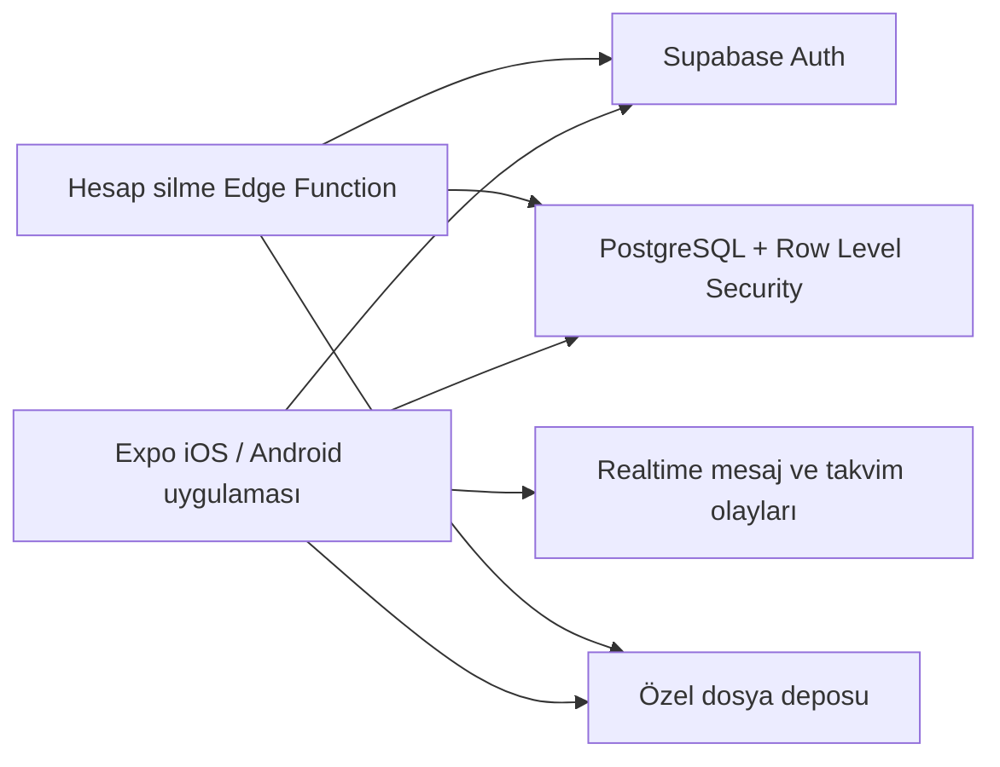

# Mimari ve üretime geçiş

## Mevcut MVP

Uygulama, ekranlardan bağımsız bir alan modeli ve servis katmanı kullanır. Kimlik, program, beslenme, ölçüm, fotoğraf, randevu ve mesaj kayıtları `AppData` içinde tip güvenli tutulur. Yerel servis katmanı veriyi AsyncStorage’a, oturum kimliğini SecureStore’a yazar.

Bu yaklaşım demosu hemen çalıştırır; fakat PT ve öğrenci farklı cihazlardayken gerçek zamanlı senkronizasyon sağlamaz. Üretim sürümünde ekranlar ve alan tipleri korunup yerel servisler ağ tabanlı repository ile değiştirilmelidir.

## Önerilen üretim yapısı

Supabase burada örnektir; Firebase veya özel bir API de aynı güvenlik sınırlarını sağladığı sürece kullanılabilir.

### Neden bu yapı

- Expo/EAS, Xcode 26 ve iOS 26 SDK ile App Store paketi üretebilir.
- Auth parolaları uygulama veritabanında değil, yönetilen kimlik servisinde kalır.
- PostgreSQL RLS her öğrencinin yalnızca kendi verisini; Cem Hoca’nın yalnızca kendisine bağlı öğrencileri görmesini sağlar.
- Fotoğraflar herkese açık URL yerine özel bucket ve kısa ömürlü imzalı URL ile sunulur.
- Realtime kanalları mesajları ve ders durumlarını iki cihaz arasında günceller.
- Sunucu fonksiyonu hesap, ilişkili satırlar, dosyalar ve kimlik kaydını tek işlem olarak siler.

## Otomatik Cem Hoca ataması

Atama yalnızca istemciye güvenmemelidir. Auth kullanıcısı oluştuğunda sunucu trigger’ı:

1. Uygulama ayarındaki `default_trainer_id` değerini okur.
2. Yeni `profiles` satırını `role = student` olarak oluşturur.
3. `trainer_id` alanına Cem Arslanoğlu’nun sabit kullanıcı kimliğini yazar.
4. İstemciden gönderilen rol veya eğitmen kimliğini yok sayar.

Böylece değiştirilmiş bir uygulama paketiyle başka PT seçilemez veya PT yetkisi alınamaz.

## Temel tablolar

| Tablo | Amaç |
|---|---|
| `profiles` | PT/öğrenci kimliği, profil ve otomatik ilişki |
| `workout_programs`, `workout_days`, `exercises` | Atanmış antrenman planı |
| `workout_completions` | Günlük hareket tamamlama |
| `nutrition_plans`, `meals` | Beslenme planı |
| `measurements` | Kilo ve çevre ölçümleri |
| `progress_photos` | Özel bucket dosya metadatası |
| `appointments` | Ders talebi ve durumları |
| `messages` | Öğrenci–PT özel mesajları |

## Yetki matrisi

| Veri | Öğrenci | Cem Hoca |
|---|---|---|
| Kendi profili | Oku/güncelle/sil | Bağlı öğrenciyi oku; PT notu/durum güncelle |
| Program/beslenme | Oku | Oluştur/güncelle |
| Ölçüm/fotoğraf | Kendi verisini ekle/oku/sil | Bağlı öğrencide oku |
| Ders | Talep et, kendi dersini gör/iptal et | Oluştur/onayla/tamamla/iptal et |
| Mesaj | Kendi konuşmasında gönder/oku | Bağlı öğrencinin konuşmasında gönder/oku |

## Güvenlik gereksinimleri

- Bütün tablolar için RLS varsayılan kapalı erişimle başlamalıdır.
- PT yetkisi kullanıcı tarafından değiştirilebilen metadata’dan alınmamalıdır.
- Fotoğraf bucket’ı public olmamalı; yol biçimi `studentId/photoId.jpg` olmalıdır.
- Mesaj gönderimi ve giriş denemeleri hız sınırına tabi tutulmalıdır.
- Loglarda parola, auth token, mesaj içeriği, ölçüm veya fotoğraf URL’si yer almamalıdır.
- Üretim hata izleme kullanılırsa fotoğraf, mesaj ve fitness verileri otomatik olarak maskelenmelidir.
- Yedekler şifreli olmalı; silme/retention politikası gizlilik metniyle aynı olmalıdır.
- Kullanıcı oturumu cihazda yalnız SecureStore/Keychain üzerinden saklanmalıdır.

## App Store için mesaj güvenliği

Mesajlar tek PT ile sınırlı özel iletişimdir. Yine de üretim sürümünde uygunsuz mesajı bildirme, iletişimi durdurma, destek iletişim bilgisi ve Cem Hoca’nın hesabı pasife alma akışı eklenmelidir. İnceleme notunda mesajların herkese açık sosyal ağ değil, mevcut öğrenci–PT ilişkisiyle sınırlandığı açıklanmalıdır.

## Hesap silme

MVP yerel kayıtları anında zincirleme siler. Üretimde profil ekranındaki aynı buton şu sunucu akışını çağırmalıdır:

1. Kullanıcıyı yeniden doğrula.
2. Özel bucket’taki tüm gelişim fotoğraflarını sil.
3. İlişkili program, plan, ölçüm, randevu ve mesajları sil/anonymize et.
4. Auth hesabını sil ve tüm refresh token’ları geçersiz kıl.
5. Uygulamaya tamamlanma bilgisi dönüp yerel oturumu kapat.

Kanunen saklanması gereken veri varsa kapsam ve süre önceden açıkça gösterilmelidir.

## Üretim sırası

1. Cem Hoca Auth hesabını ve sabit `default_trainer_id` ayarını oluştur.
2. Şema, RLS politikaları ve özel fotoğraf bucket’ını kur.
3. Yerel auth/storage çağrılarını Supabase repository ile değiştir.
4. Realtime mesaj ve randevu aboneliklerini ekle.
5. Sunucu tarafı hesap silme ve fotoğraf temizleme fonksiyonunu ekle.
6. Bildirimler gerekiyorsa yalnız mesaj/ders metadatası içeren APNs bildirimleri ekle.
7. Fiziksel iPhone’da izin, düşük ağ, çevrimdışı ve hesap silme testlerini yap.

## Kapsam dışı

- Yapay zekâ, otomatik program üretimi veya AI sohbeti yoktur.
- HealthKit entegrasyonu yoktur.
- Ödeme/abonelik yoktur.
- Çoklu PT, komisyon ve davet kodu yoktur.

